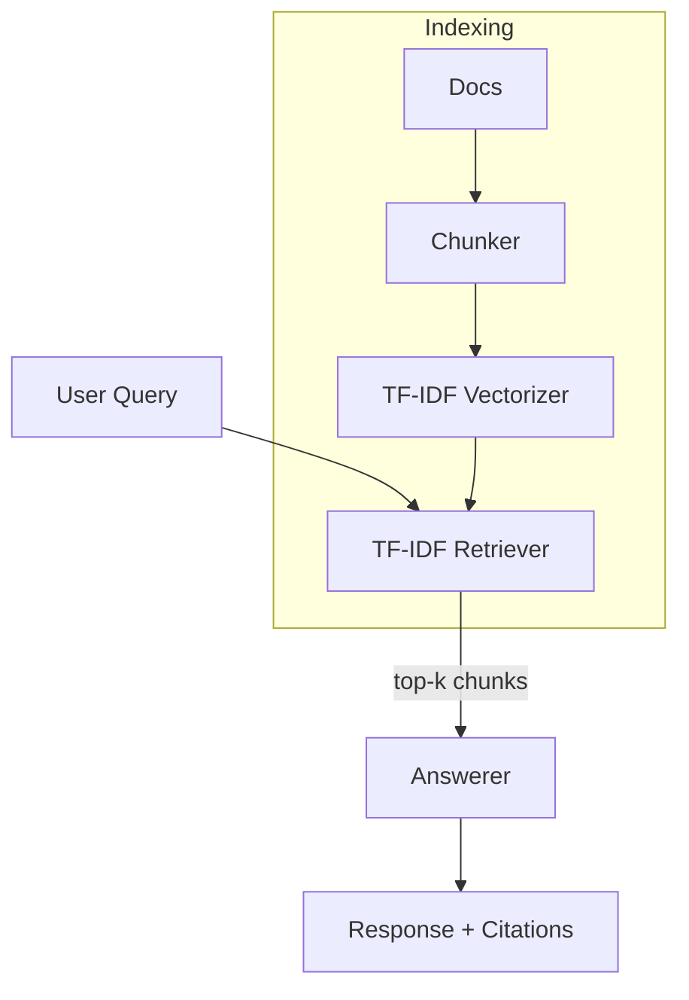

# Simple, Offline-Friendly RAG Demo (AI Engineering & Content Internship)

Build-and-explain RAG demo that runs locally without API keys, yet can use an LLM if you add one. It includes:
- TF‑IDF retrieval over local docs
- Chunking + top‑k context selection
- Offline answerer (extractive/summary) with citations
- Optional LLM call (via OpenAI HTTP) if OPENAI_API_KEY is set
- CLI tool, tests, and a detailed blog

## What it does and why it’s useful
This demo shows the core of Retrieval-Augmented Generation (RAG):
1) Split local documents into chunks.
2) Build a vector index (TF‑IDF) to find relevant chunks for a query.
3) Generate an answer grounded in the retrieved chunks, with citations.

It’s useful for learning RAG without heavy dependencies or paid APIs, and can be extended to embeddings, vector DBs, and agents.

## Quickstart

### 1) Create and activate a Python env (optional but recommended)
```pwsh
# Windows PowerShell
python -m venv .venv
. .venv/Scripts/Activate.ps1
```

### 2) Install dependencies
```pwsh
pip install -r requirements.txt
```

### 3) Run a sample query (offline mode by default)
```pwsh
python -m src.app.cli "What is RAG and why use it?"
```

### 4) (Optional) Use an LLM for generation
Set your API key and pick a model (defaults are reasonable):
```pwsh
$env:OPENAI_API_KEY = "sk-..."
python -m src.app.cli "What is RAG and why use it?" --provider openai --model gpt-4o-mini
```

## Project structure
- `src/app/rag_pipeline.py` – Loader, splitter, vector store, retriever, and answerers
- `src/app/cli.py` – Command-line entry point
- `data/` – Sample content used for retrieval
- `tests/` – Minimal tests for retrieval and answering
- `blog.md` – Detailed tutorial-style blog draft
- `requirements.txt` – Dependencies

## Diagram


## Notes
- Offline mode doesn’t call external APIs; it summarizes and cites from retrieved chunks.
- With an API key, answers are LLM-generated but still grounded with retrieved context.
- Extendable: swap TF‑IDF for embeddings, add a vector DB, or wrap with a web UI.

## License
MIT
